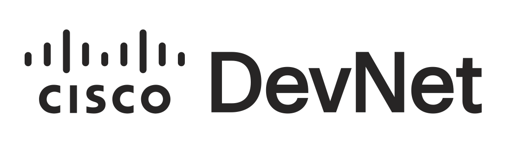

<h1 align="center">🤖 AI Compliance Agent<br /><br />
<div align="center">

</div>

<div align="center">


</div>

</h1>

<div align="center">
An <strong>AI-powered network compliance management system</strong> that integrates with <strong>Cisco NSO</strong> and <strong>Crosswork Workflow Manager (CWM)</strong> to automate configuration compliance verification, drift detection, and remediation across network devices.
<br /><br />
Built with <a href="https://github.com/langchain-ai/langgraph"><strong>LangGraph</strong></a> for intelligent multi-step agent orchestration, and a <a href="https://react.dev/"><strong>React</strong></a> chat interface with human-in-the-loop approval gates.
<br /><br />
</div>

> **Disclaimer**: This project was developed for experimentation and learning purposes at Cisco Live 2025 Amsterdam.

---

## 🚀 Overview

This system provides an intelligent compliance agent that uses LLMs to orchestrate multi-step compliance workflows. Network engineers can verify device configurations against golden standards, analyze violations, and execute approved remediation actions — all through a conversational chat interface.

The agent follows a structured workflow: **Analyze → Plan → Approve → Execute → Verify**, with human approval gates before any critical changes are applied to the network.

## ⚙️ Features

### Core Capabilities
- 📋 **Compliance Report Management** — Configure, execute, and analyze NSO compliance reports against golden configs
- 🔍 **Drift Detection** — Track configuration drift over time across multiple network devices
- 🧠 **AI-Powered Analysis** — LLM-driven analysis of compliance violations with remediation recommendations
- 🔧 **Automated Remediation** — Execute remediation workflows via CWM (sync-to, re-deploy, apply-template)
- ✅ **Human-in-the-Loop (HITL)** — Interactive approval gates before executing critical changes
- 🕐 **Scheduling** — Schedule remediation workflows for specific execution times

### Integrations
- 🔌 **Multi-LLM Support** — Compatible with OpenAI, Azure, Groq, NVIDIA NIM, and Anthropic models via LiteLLM
- 🌐 **Cisco NSO** — CLI (pyATS/SSH), REST API, and JSON-RPC connectors
- 📦 **Cisco CWM** — Crosswork Workflow Manager for remediation execution

## 🏗️ Architecture

```
┌─────────────────────┐
│      Frontend       │  React / TypeScript (Port 3002)
│     (Chat UI)       │
└─────────┬───────────┘
          │ HTTP / Streaming
          ▼
┌──────────────────────────────┐
│  Compliance Agent (FastAPI)  │  Port 9090
├──────────────────────────────┤
│  LangGraph State Machine     │
│  ├── Analyzer Node           │
│  ├── Planner Node            │
│  ├── Executor Node           │
│  └── Tools Node              │
└──────────┬───────────────────┘
           │
           ├──▶ NSO CLI (pyATS/SSH)  ──▶ NSO Server
           ├──▶ NSO REST API         ──▶ NSO Server
           └──▶ CWM REST API         ──▶ Crosswork Server
```

## 🧰 Agent Tools

| Tool Category | Description | Key Actions |
|---------------|-------------|-------------|
| **NSO Tools** | Interact with Cisco NSO for compliance operations | Trigger reports, retrieve results, download reports |
| **Compliance Tools** | Manage report definitions and templates | Create/update report definitions, manage golden configs |
| **Remediation Tools** | Execute configuration remediation actions | Sync-to, re-deploy, apply-template operations |
| **CWM Tools** | Orchestrate workflows via Crosswork | Execute workflows, check job status, schedule jobs |

## 📁 Project Structure

```
ai-compliance/
├── agents/compliance/           # Backend compliance agent
│   ├── main.py                  # FastAPI entry point
│   ├── graph/                   # LangGraph state machine & models
│   ├── tools/                   # LangChain tools
│   │   ├── nso_lc_tools.py      #   NSO report tools
│   │   ├── cwm_lc_tools.py      #   CWM execution tools
│   │   ├── compliance_lc_tools.py   #   Compliance analysis tools
│   │   ├── remediation_lc_tools.py  #   Remediation action tools
│   │   └── connectors/          #   Backend integrations (CLI, REST, JSON-RPC)
│   └── prompts/                 # LLM system prompts
├── frontend/                    # React/TypeScript web UI
│   ├── src/
│   │   ├── components/          #   Chat, Sidebar, graph visualization
│   │   ├── stores/              #   Zustand state management
│   │   └── hooks/               #   Custom React hooks
│   └── Dockerfile.ui
├── config/                      # Configuration & logging
├── common/                      # Shared utilities (LLM factory, LiteLLM shim)
├── workflows/                   # CWM workflow definitions (AUDIT, REMEDIATION)
├── docker/                      # Docker build files
├── docker-compose.yaml          # Multi-container orchestration
├── pyproject.toml               # Python dependencies (uv)
└── .env.example                 # Environment variable template
```

## 🧩 Prerequisites

- Python 3.13+
- Node.js 16.14.0+
- Docker & Docker Compose (for containerized deployment)
- Access to a Cisco NSO instance (SSH/REST)
- Access to a Cisco CWM instance (HTTPS)
- An LLM API key (OpenAI, Azure, Groq, NVIDIA NIM, or Anthropic)

## 🛠️ Installation

### 1. Clone the repository

```bash
git clone <repository-url>
cd ai-compliance
```

### 2. Configure environment variables

```bash
cp .env.example .env
# Edit .env with your NSO/CWM credentials and LLM API key
```

### 3a. Local Development

**Backend:**

```bash
# Create virtual environment and install dependencies (using uv)
uv venv
uv sync --locked

# Start the compliance agent
python agents/compliance/main.py
# Runs on http://0.0.0.0:9090
```

**Frontend:**

```bash
cd frontend
npm install
npm run dev
# Runs on http://localhost:5173
```

### 3b. Docker Compose (Recommended)

```bash
docker-compose up --build
```

| Service            | URL                      |
|--------------------|--------------------------|
| Frontend UI        | `http://localhost:3002`   |
| Compliance Agent   | `http://localhost:9090`   |

## ⚙️ Configuration

Key environment variables (see `.env.example` for the full list):

### LLM Settings

| Variable             | Description                | Example            |
|----------------------|----------------------------|--------------------|
| `LLM_MODEL`          | LLM model identifier      | `openai/gpt-4o`   |
| `OPENAI_API_KEY`     | LLM provider API key      | `sk-...`           |
| `OPENAI_TEMPERATURE` | Sampling temperature       | `0.7`              |

### NSO Connection

| Variable           | Description              | Example        |
|--------------------|--------------------------|----------------|
| `NSO_HOST`         | NSO server address       | `127.0.0.1`   |
| `NSO_CLI_PORT`     | NSO SSH CLI port         | `2024`         |
| `NSO_USERNAME`     | NSO credentials          | `admin`        |
| `NSO_PASSWORD`     | NSO credentials          | `admin`        |
| `NSO_PROTOCOL`     | REST API protocol        | `http`         |
| `NSO_JSONRPC_PORT` | JSON-RPC port            | `8080`         |

### CWM Connection

| Variable         | Description            | Example            |
|------------------|------------------------|--------------------|
| `CWM_HOST`       | CWM server address     | `cwm.example.com`  |
| `CWM_PORT`       | CWM server port        | `443`              |
| `CWM_USERNAME`   | CWM credentials        | `admin`            |
| `CWM_PASSWORD`   | CWM credentials        | `password`         |

## 🎯 Usage

### API Endpoints

| Endpoint                  | Method | Description                        |
|---------------------------|--------|------------------------------------|
| `/agent/prompt/stream`    | POST   | Stream compliance agent responses  |
| `/health`                 | GET    | Health check                       |
| `/transport/config`       | GET    | Get transport configuration        |

### Example Request

```bash
curl -X POST http://localhost:9090/agent/prompt/stream \
  -H "Content-Type: application/json" \
  -d '{"prompt": "Run a compliance check on device router-1", "thread_id": "session-1"}'
```

### Typical Workflow

```
1. Ask       ──▶  Configure and run a compliance report for target devices
2. Review    ──▶  Analyze compliance results and violation details
3. Approve   ──▶  Review and approve the remediation plan (HITL)
4. Execute   ──▶  Run approved remediation actions via CWM workflows
5. Verify    ──▶  Confirm compliance status after remediation
```

## 🧪 Testing

```bash
# Backend tests
pytest agents/compliance/tools/connectors/nso_connector_cli/tests/
pytest agents/compliance/tools/connectors/cwm_connector/tests/

# Frontend linting & formatting
cd frontend
npm run lint
npm run format
```

## 📚 Tech Stack

| Layer            | Technologies                                              |
|------------------|-----------------------------------------------------------|
| **Backend**      | Python, FastAPI, LangChain, LangGraph, LiteLLM, pyATS, Pydantic |
| **Frontend**     | React, TypeScript, Vite, Tailwind CSS, React Flow, Zustand |
| **Infrastructure** | Docker, Docker Compose                                  |

## 📜 License

<!-- Add your license here -->

---

<div align="center">
<strong>Built for Cisco Live 2025 Amsterdam</strong>
</div>
